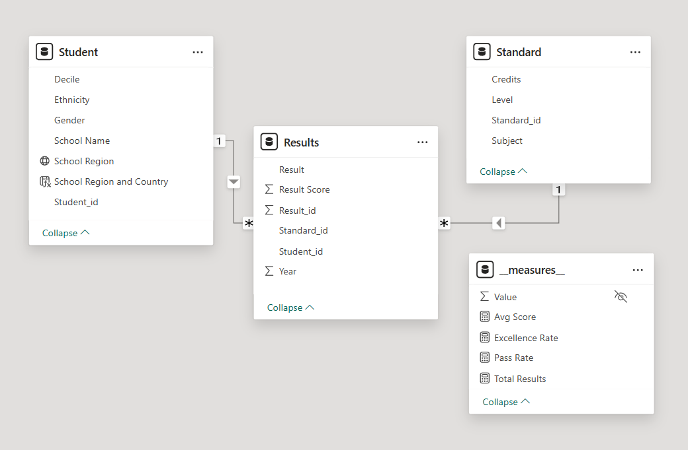
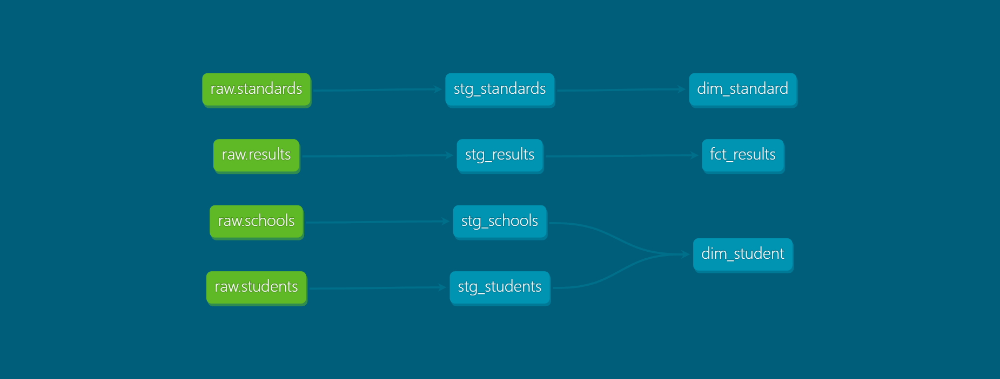

# 📊 Student Achievement & Equity Analytics Dashboard

## 🧩 Overview

This project presents an end-to-end data analytics solution for analysing student academic performance and equity across schools, subjects, and socio-economic contexts.

It demonstrates a modern data stack using Snowflake, dbt, and Power BI, covering the full pipeline from raw data ingestion to interactive dashboard visualisation.

---

## 🎯 Objectives

- Analyse student performance (pass rate, excellence rate, average score)
- Identify equity gaps across school deciles and regions
- Track trends over time
- Deliver an interactive dashboard for data-driven insights

---

## 🏗️ Architecture

- Raw CSV Data
- Snowflake (RAW, STAGING, and MARTS layers)
- dbt (STAGING → MARTS)
- Power BI Dashboard

---

## 📁 Repository Structure
```
📦 student-analytics-dashboard
├─ data
│  └─ raw
├─ dbt
│  └─ analytics_project
│     ├─ dbt_project.yml
│     └─ models
│        ├─ marts
│        │  ├─ dim_standard.sql
│        │  ├─ dim_student.sql
│        │  └─ fct_results.sql
│        ├─ schema.yml
│        ├─ sources.yml
│        └─ staging
│           ├─ stg_results.sql
│           ├─ stg_schools.sql
│           ├─ stg_standards.sql
│           └─ stg_students.sql
├─ powerbi
│  ├─ PBIP
│  │  └─ student_analytics_dashboard.pbip
│  ├─ student_analytics_dashboard.pbix
│  └─ student_analytics_dashboard.pdf
└─ screenshots
   ├─ dbt-dag.png
   ├─ powerbi-schema.png
   └─ snowflake_analytics_db.png
```
---

## 🗄️ Data Model

A **star schema** is implemented for analytical performance.



## ⚙️ Data Pipeline



### 1. Data Ingestion
- CSV files loaded into Snowflake (RAW schema)

### 2. Data Transformation (dbt)
- Staging layer: data cleaning and standardisation
- Mart layer: star schema (fact + dimensions)
- Dependencies managed using `ref()` and `source()`

### 3. Data Quality
Key data quality checks implemented in dbt:

- **Decile Range Validation**  
  Ensures school decile values are within the valid range (1–10)

- **Result Category Validation**  
  Ensures only valid NCEA result values are present:
  `Excellence`, `Merit`, `Achieved`, `Not Achieved`

- **Primary Key Constraints**  
  Enforced uniqueness of IDs (e.g., student_id, result_id)

- **Referential Integrity**  
  Validated relationships between fact and dimension tables

---

## 📈 Dashboard Features

[📥 Open Dashboard PDF](powerbi/student_analytics_dashboard.pdf)

### 🟦 Overview
- KPI cards (Total Results, Avg Score, Pass Rate, Excellence Rate)
- Results distribution
- Trend over time

### 🟩 School & Equity Analysis
- Performance by school
- Decile-based analysis
- Regional comparison

### 🟨 Academic Deep Dive
- Performance by subject and level
- Credits vs results
- Detailed table view

---

## 🛠️ Tech Stack

- Snowflake (Cloud Data Warehouse)
- dbt (Data Transformation)
- Power BI (Data Visualisation)
- SQL

---

## 🚀 How to Run the Project

#### 1. Set up Snowflake
- Create database and schemas (`RAW`, `STAGING`, `MARTS`)
- Upload CSV files into RAW layer

#### 2. Run dbt

```bash
cd dbt/analytics_project
dbt debug
dbt run
dbt test